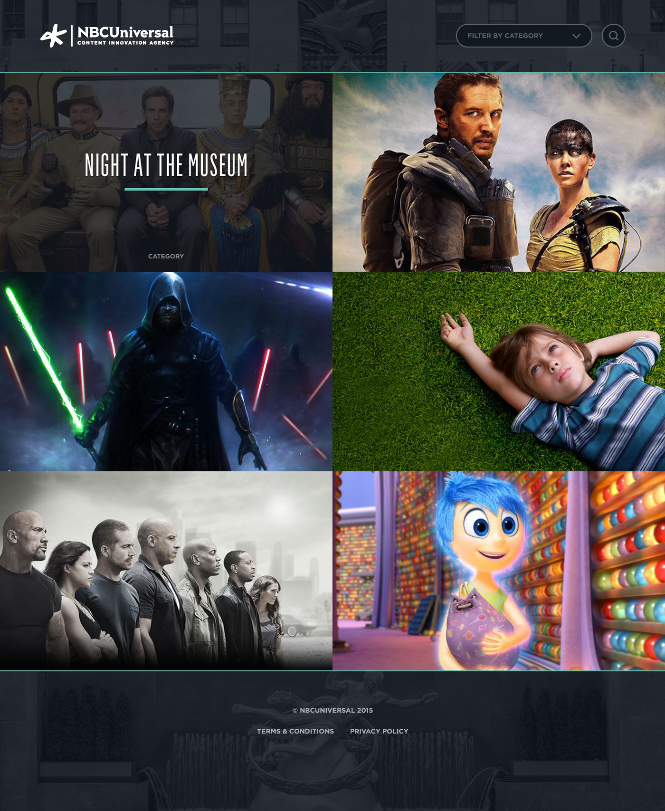
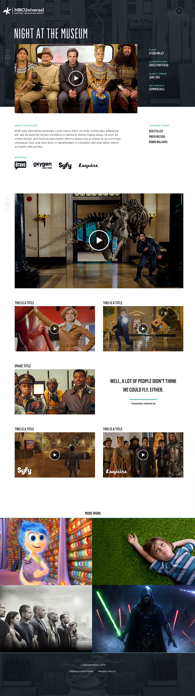

### Information Architecture & Visual Design

This portfolio site was designed to help the Content Innovation Agency share successful marketing campaigns with media planners. The site structure facilitates easy navigation between the gallery of projects and case study pages, where key pieces of information are available at a glance. The sleek design reinforces the NBCU brand, while letting the featured work be the primary focus.

